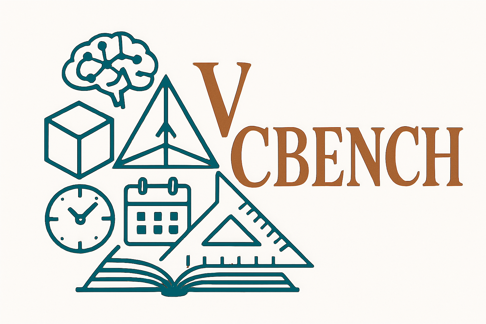
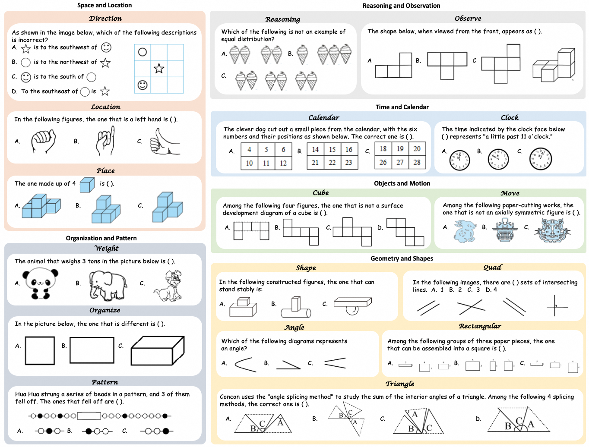
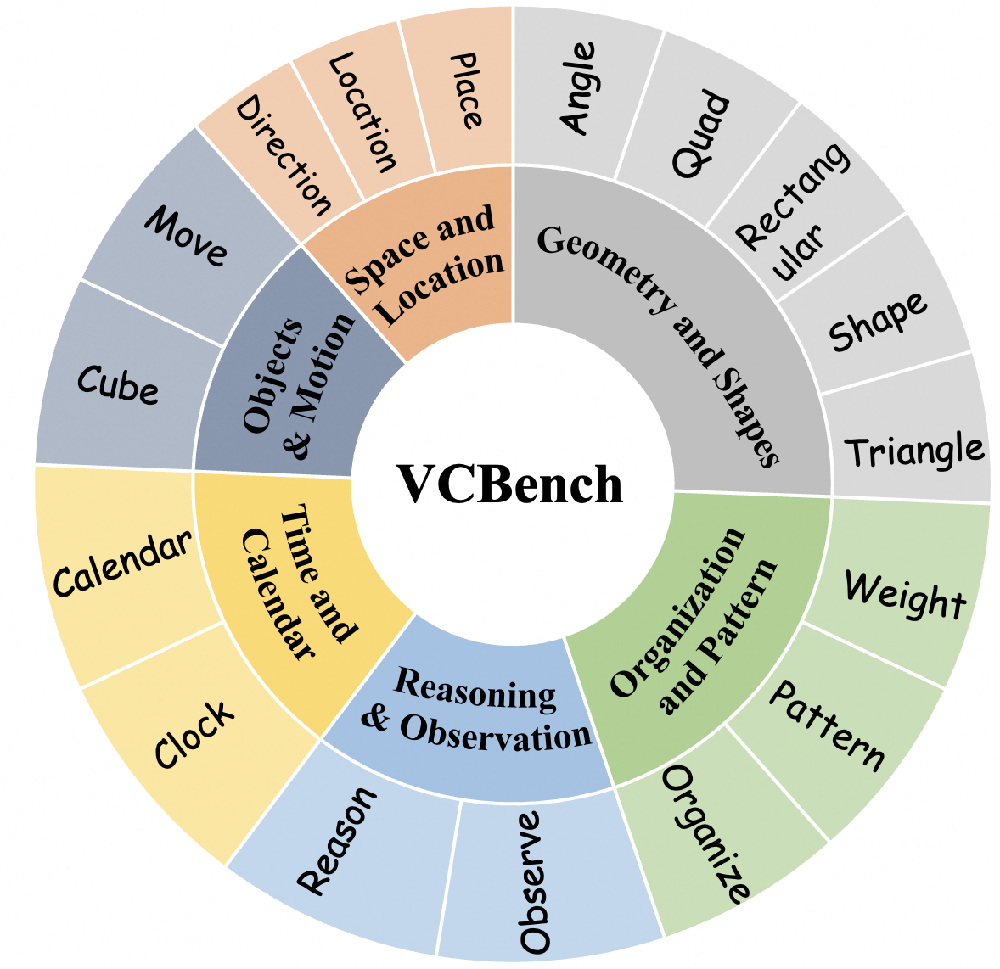
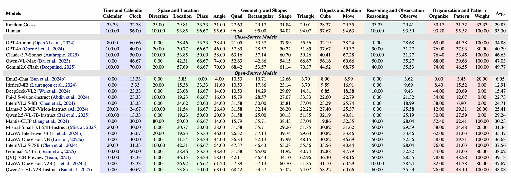

# VCBench: Benchmarking Multimodal Mathematical Reasoning with Explicit Visual Dependency

<p align="center">
  
</p>


This is the official repo for VCBench, a comprehensive benchmark designed for assessing multimodal mathematical reasoning tasks with explicit visual dependencies.

<div style='display:flex; gap: 0.25rem; flex-wrap: wrap; align-items: center;'>
  <a href='LICENCE'>
    
  </a>
  <a href='https://arxiv.org/abs/2504.18589'>
    
  </a>
  <a href='https://x.com/danielwong404'>
    
  </a>
  <a href='https://huggingface.co/datasets/cloudcatcher2/VCBench'>
    
  </a>
  <a href='https://alibaba-damo-academy.github.io/VCBench/index.html#Leaderboard1'>
    
  </a>
  <a href='https://alibaba-damo-academy.github.io/VCBench/'>
    
  </a>
</div>


## 🔥 Update
* [2025-04-10]: 🚀 Paper, Codes and Datas of VCBench online. Check out [this link](https://alibaba-damo-academy.github.io/VCBench/) for details.


## 🎯 Overview

<p align="center">
  
</p>


### Dataset

The VCBench dataset consists of 1720 question answer pairs $(Q,A^*)$ and 6697 images.

The question-answer pairs and corresponding images can be found [here](https://huggingface.co/datasets/cloudcatcher2/VCBench).

### Experiment

we assessed 24 state-of-the-art LVLMs across 17 distinct task categories within VCBench, evaluates five distinct model competencies: temporal reasoning, geometric reasoning, logical reasoning, spatial reasoning, and pattern recognition.

<p align="center">
  
</p>


Despite achieving near-perfect accuracy on normal human-level performance, the best-performing visual models were unable to exceed 50\% accuracy. This underscores the significant challenges that remain in the integration of visual and mathematical reasoning at the elementary level and highlights the need for further research in developing models that can handle the complexities of multi-modal, visually dependent reasoning tasks.

<p align="center">
  
</p>


## 🤖 Automatic Evaluation

For model evaluation, please refer to [evaluation](evaluation/README.md).

## 🏆 Leaderboard

The [Leaderboard](https://alibaba-damo-academy.github.io/VCBench/index.html#Leaderboard1) for VCBench is continuously being updated, welcoming the contribution of your LVLMs!

Please note that to thoroughly evaluate your own LVLM, you are required to provide us with `jsonl` file. These should include the question-id and your final response. We have provided a submission format in the `submit.jsonl` file. After completing the aforementioned steps, please contact us via gasolsun36@gmail.com to submit your results and to update the leaderboard.

## 📧 Contact

- [Zhikai Wang](https://cloudcatcher888.github.io/): wangzhikai.wzk@alibaba-inc.com
- [Jiashuo Sun](https://gasolsun36.github.io/): gasolsun36@gmail.com

## 📝 Citation

If you find our work helpful for your research, please consider giving a star and citation.
```bibtex
@misc{wong2025vcbench
  author    = {Zhikai Wang and Jiashuo Sun and Wenqi Zhang and Zhiqiang Hu and Xin Li and Fan Wang and Deli Zhao},
  title     = {Benchmarking Multimodal Mathematical Reasoning with Explicit Visual Dependency},
  year      = {2025},
  eprint    = {2504.18589},
  archivePrefix = {arxiv},
  primaryClass  = {cs.CV},
  url       = {https://arxiv.org/abs/2504.18589}
}
```